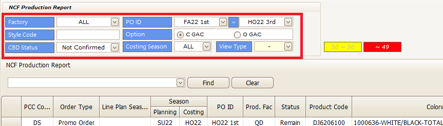
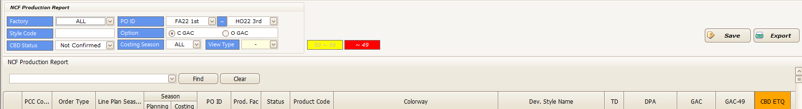
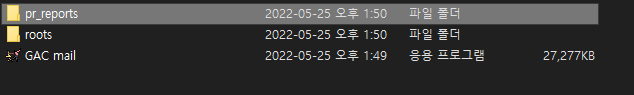
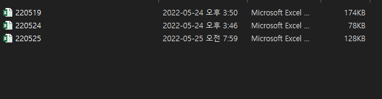
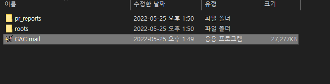
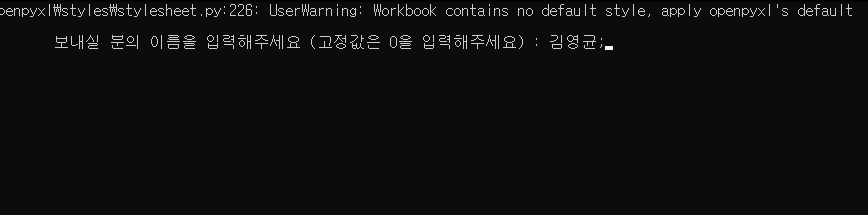
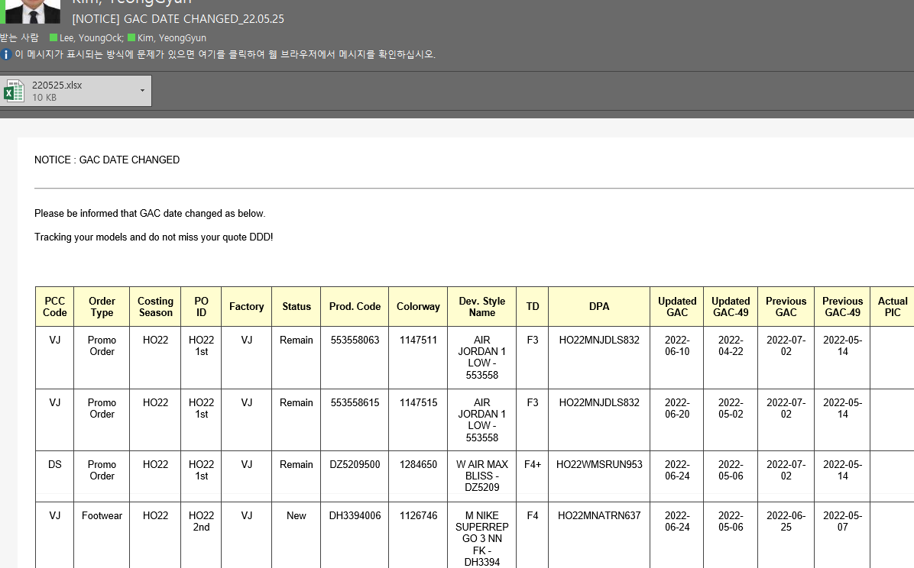

[toc]

# GAC UPDATE TRACKING 메일 자동화 사용법

> GAC 업데이트 자동화 사용법 입니다.
>
> 220525ver.

## MANUAL

1. NCF Production Report 에 들어가서 범위를 설정하고 다음과 같은 조건으로 검색한다.

   

2. Export를 눌러 엑셀파일을 추출한다.

   

3. 해당 파일을 pr report로 넣어준다. 이때 형식에 맞춰 오늘 날짜로 저장해 준다. (e.g. 220525)

   

   

4. 프로그램을 실행시킨다.

   

5. (업데이트 후 사라질 예정) 고정값은 0, 보내고자 하는 사람의 이름을 입력해 준다.

   

6. 메시지를 확인한다.

   

## CAUTION & REMARK

* OUTLOOK을 킬 필요는 없다.
* 해당 파일은 roots에 날짜별로 저장된다.
* **pr_reports의 엑셀파일을 <u>끄고</u> 실행해야 한다.**

## PATCH NOTE

### 220525

* 첫 테스트
* 추후 고정 주소 업데이트 예정
* 테스트 기간 거쳐 전체 버전으로 전달예정
* *PIC별 진행 예정*

